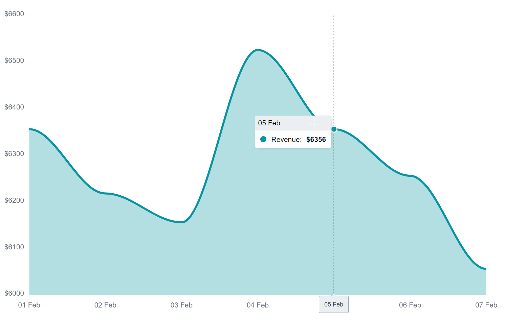

## dash-holoniq-apexcharts


 Dash wrapper for the [react-apexcharts](https://github.com/apexcharts/react-apexcharts) library

## Usage

    pip install dash-holoniq-apexcharts

## Documentation

Configuration options can be found [here](https://apexcharts.com/docs/react-charts/)

### Simple Barchart Example


**See usage.py**
```
from dash_holoniq_apexcharts import DashApexcharts
import dash
from dash import  html

app = dash.Dash(__name__)


app.layout = html.Div([
    DashApexcharts(
        options = {
            'chart': {'id': 'apex-chart-example'},
            'xaxis': {
              'categories': [1991, 1992, 1993, 1994, 1995, 1996, 1997, 1998, 1999]}
        },

        series = [{
            'name': 'series-1',
            'data': [30, 40, 35, 50, 49, 60, 70, 91, 125]
        }],

        type = "bar",
        width=500,
        height=320
    )
])


if __name__ == '__main__':
    app.run_server(debug=False, host="0.0.0.0", port=5000)
```

### More complex area chart

[sales.py](./sales.py), is a more complex example showing how to control color, grids and
format X & Y axis labels.



**sales.py**
```
from dash_holoniq_apexcharts import DashApexcharts
import dash
from dash import html

app = dash.Dash(__name__)


SALES_CHART = {
    "chart": {
        "fontFamily": "Inter, sans-serif",
        "foreColor": "#6B7280",
        "toolbar": {"show": False},
    },
    "fill": {
        "type": "solid",
        "opacity": 0.3,
    },
    "dataLabels": {"enabled": False},
    "tooltip": {
        "style": {
            "fontSize": "14px",
            "fontFamily": "Inter, sans-serif",
        },
    },
    "grid": {
        "show": False,
    },
    "xaxis": {
        "categories": ["01 Feb", "02 Feb", "03 Feb", "04 Feb", "05 Feb", "06 Feb", "07 Feb"],
        "labels": {
            "style": {
                "colors": ["#6B7280"],
                "fontSize": "14px",
                "fontWeight": 500,
            },
        },
        "axisBorder": {
            "color": "#F3F4F6",
        },
        "axisTicks": {
            "color": "#F3F4F6",
        },
    },
    "yaxis": {
        "labels": {
            "style": {
                "colors": ["#6B7280"],
                "fontSize": "14px",
                "fontWeight": 500,
            },
            'formatter': "${value}"
        },
    },
    "responsive": [{"breakpoint": 1024, "options": {"xaxis": {"labels": {"show": False}}}}],
}


def sales_chart():
    series = {"name": "Revenue", "data": [6356, 6218, 6156, 6526, 6356, 6256, 6056], "color": "#0694a2"}
    chart = DashApexcharts(options=SALES_CHART, series=[series], type='area', width=420)

    return chart


app.layout = html.Div([sales_chart()])

if __name__ == '__main__':
    app.run_server(debug=False, host="0.0.0.0", port=5000)
```
