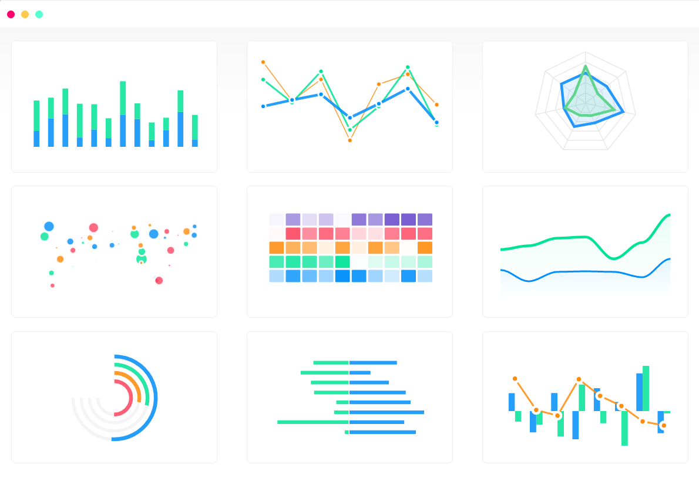
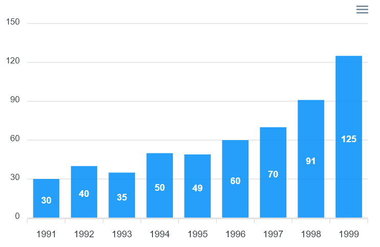

## dash-holoniq-apexcharts



 Dash wrapper for the [react-apexcharts](https://github.com/apexcharts/react-apexcharts) library

## Usage

    pip install dash-holoniq-apexcharts

    python usage.py

## Documentation

Configuration options can be found [here](https://apexcharts.com/docs/react-charts/)

## Barchart Example



**See usage.py**
```
from dash_holoniq_apexcharts import DashApexcharts
import dash
from dash import  html

app = dash.Dash(__name__)


app.layout = html.Div([
    DashApexcharts(
        options = {
            'chart': {'id': 'apex-chart-example'},
            'xaxis': { 'categories': [1991, 1992, 1993, 1994, 1995, 1996, 1997, 1998, 1999]}
        },

        series = [{
            'name': 'series-1',
            'data': [30, 40, 35, 50, 49, 60, 70, 91, 125]
        }],

        type = "bar",
        width=500,
        height=320
    )
])


if __name__ == '__main__':
    app.run_server(debug=False, host="0.0.0.0", port=5000)
```


